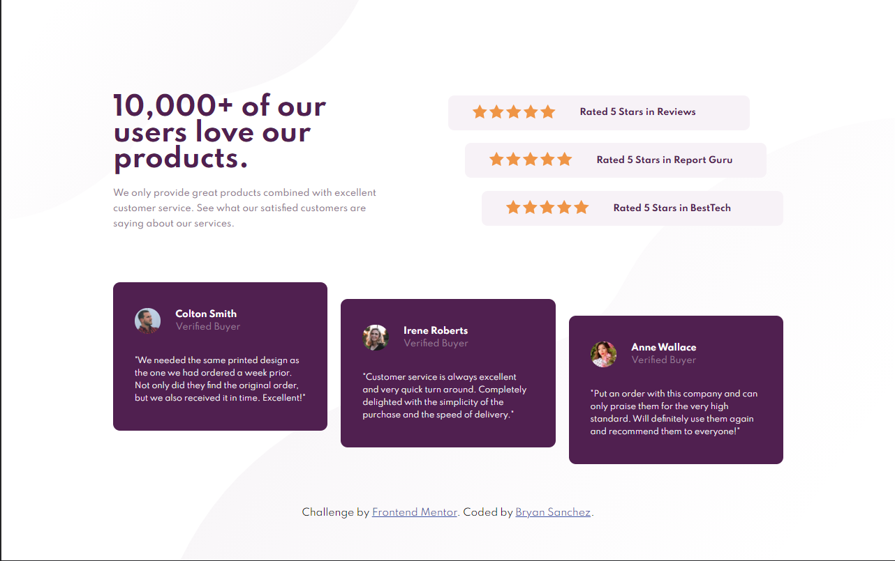

# Frontend Mentor - Social proof section solution

This is a solution to the [Social proof section challenge on Frontend Mentor](https://www.frontendmentor.io/challenges/social-proof-section-6e0qTv_bA). Frontend Mentor challenges help you improve your coding skills by building realistic projects. 

## Table of contents

- [Frontend Mentor - Social proof section solution](#frontend-mentor---social-proof-section-solution)
  - [Table of contents](#table-of-contents)
  - [Overview](#overview)
    - [The challenge](#the-challenge)
    - [Screenshot](#screenshot)
    - [Links](#links)
  - [My process](#my-process)
    - [Built with](#built-with)
    - [What I learned](#what-i-learned)
    - [Continued development](#continued-development)
    - [Useful resources](#useful-resources)
  - [Author](#author)

## Overview

### The challenge

Users should be able to:

- View the optimal layout for the section depending on their device's screen size

### Screenshot



### Links

- Solution URL: [Github](https://github.com/Bry-cmd/social-proof-section-master)
- Live Site URL: [Github Pages](https://bry-cmd.github.io/social-proof-section-master/)

## My process

### Built with

- Semantic HTML5 markup
- CSS custom properties
- Flexbox

### What I learned

I did this challenge to familiarize myself with CSS Flexbox and so most of my learnings taken from this challenge is about Flexbox.

I learned that flexbox has a lot more properties that I need to control as compared to grid. I had to specify not only the display of the flex container, but also the orientation of the container's children as well as the direction the children were aligned in. A declaration example of these properties are shown below:

```css
.container {
  display: flex;
  flex-direction: row;
  align-content: center;
  justify-content: space-evenly;
}
```

From this challenge, I've come to realize that flexbox is really useful when doing layouts that require even spacing since the properties of flexbox allow me to specify this automatically instead of having to do so manually.

Finally, I've also learned to use the <b>rem</b> unit a lot better. I found this unit useful because it allows me to set the font sizes of the different parts of the site and change them by setting the root font size. An example of this is shown below:

```css
:root {
  font-size: 16px;
}

.item1 p {
  font-size: 1rem; /* p element will have font size of 16px */
}

.item2 p {
  font-size: 2rem; /* p element will have font size of 32 px */
}

/* By changing root font size to some other value, the p element font sizes will scale accordingly */
```

This was extremely useful for the responsive design aspect of the project since, instead of manually adjusting each font size of the different elements, I could just change the root font size and have all the elements scale accordingly.

### Continued development

For future projects, I want to continue using flexbox and/or grid for doing layouts since I've found them extremely useful and I think I still have a lot more to learn about them. 

I also plan to learn more about mobile-first responsive design as well as using the rem unit more often to pick up better practices when creating responsive designs. 

Finally, I wish to start getting more into JavaScript for future projects to make my projects more dynamic. I plan to start doing challenges that require me to use JS so that I can force myself into learning it well.


### Useful resources

- [CSS Tricks](https://css-tricks.com/) - This website helped introduce me to flexbox and learn a lot about its different properties
- [w3schools](https://www.w3schools.com/) - This website provides amazing articles that gave me information on how to use different properties in CSS.

## Author

- Github - [Bry-cmd](https://github.com/Bry-cmd)
- Frontend Mentor - [@Bry-cmd](https://www.frontendmentor.io/profile/Bry-cmd)